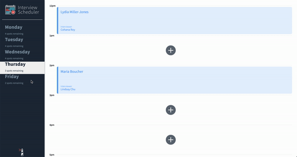

# Interview Scheduler
[I'm an inline-style link with title](https://www.google.com "Google's Homepage")

A web application built with React which allows users to book/ edit/ cancel interviews with ease!

## Final Product



## Setup

Install dependencies with `npm install`.

## Running Webpack Development Server

```sh
npm start
```

## Running Jest Test Framework

```sh
npm test
```

## Running Storybook Visual Testbed

```sh
npm run storybook
```
